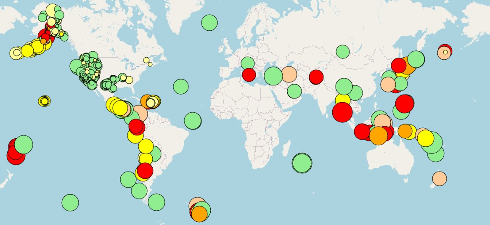
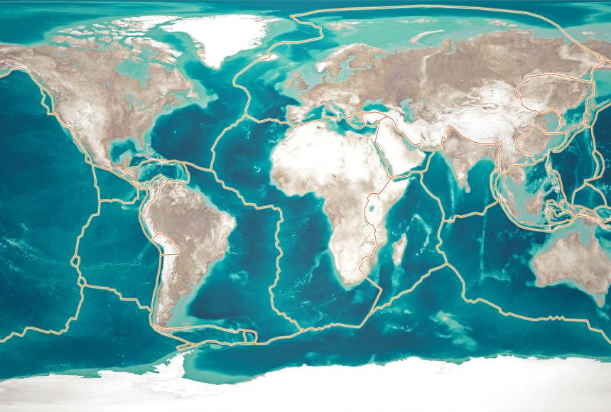

# leaflet-challenge
----------------------------------------

## Interactive Leaflet Earthquake Map
The United States Geological Survey, or USGS for short, is responsible for researching and providing data about all things that affect our ecosystems and environment.
In this challenge, I am tasked with helping The USGS to build a new set of tools to help visualize earthquake data, which falls under their umbrella of environmental research. I accessed their data through their [USGS GeoJSON Data Feed](http://earthquake.usgs.gov/earthquakes/feed/v1.0/geojson.php) to plot an interactive world map using ***Leaflet.js** to better visualize where these earthquakes are happening and certain characteristics about them. 

## Table of Contents

- [About & Process](#about--process)
- [Analysis](analysis)
- [Getting Started & Installing](#getting-started--installing)
- [Resources](resources)
- [Contributing](#contributing)

## About & Process
To begin I first fetched their data through a **GET request** `.then()` function to access the earthquake data from the site listed above, and logged to the console to verify its success.  
Afterwards I began defining my two main functions to plot the actual world map along with the appropriate earthquake markers. First was the `createFeatures()` function which created the unique map features such as a **circle marker** plotting the location of each earthquake, the size of which represents the magnitude of the earthquake. The color of the marker that represents the depth of the earthquake (see legend in the bottom right of the webpage to identify the color system). Finally a popup on each marker that shows when the marker is clicked that provides information on the earthquake.  
Secondly the `createMap()` function which creates the layers of the map, which can be seen and selected as desired in the top-right of the map. Two base layers, a "street map" layer which shows all world borders and a "borderless topographic" map that shows all world topography with no borders. One overlay map which alongs you to show the earthquake markers.  
As well create the map with standard `let myMap = L.map` statement with my specific parameters such as the centred view, zoom level and layers (which are the two base layers I described above). A layer control which allows you to select between the different layers to view the world map as you wish. And finally a legend which shows the color scale representing the depth in km of each earthquake by their color.  
In the `style.css` file I added to the provided `body{}` code with some sylzing of the legend, such as its position, background color, title and sizing.  
The `index.html` file was pre-completed and provided for this challenge.

## Analysis
Upon completing the world map with the different layers and plotted earthquake markers I noticed a certain pattern forming for the location of the earthquakes. As seen in the screenshot of my map below. For e.g. large clusters of earthquakes that follow certain areas such as the southern coastal area of Alaska, and South-Pacific Asia. 
   
Upon further investigation I found that these areas follow the lines of Earth's ***Tectonic Plates*** which are enormous sections of Earth’s crust that roughly fit together and meet at places called plate boundaries, and  the vast majority of earthquakes occur along these lines. The USGS defines an earthquake as "what happens when two blocks of the earth suddenly slip past one another. The surface where they slip is called the fault or fault plane". Earthquakes can occur inside plate boundaries although the USGS states that less than 10% of all earthquakes occur within plate interiors. Upon referencing back to the map image above which charts all the world's earthquakes over the last 7 days, the earthquake markers verify this data from the USGS. As almost all occur along these lines and very few are inside of the plates.  

## Getting Started & Installing
Requirements to run project:
* A web browser such as **Chrome** to be able to view and inspect the dashboard. 
* A code/text editor able to handle Javascript and HTML files, I Recommend **VS Code**.  
No other installations or packages are needed.

##  Resources

* [USGS GeoJSON Data Feed](http://earthquake.usgs.gov/earthquakes/feed/v1.0/geojson.php)
* [The Science of Earthquakes](https://www.usgs.gov/programs/earthquake-hazards/science-earthquakes#:~:text=An%20earthquake%20is%20what%20happens,the%20fault%20or%20fault%20plane.)
* [Where Earthquakes Occur](https://pubs.usgs.gov/gip/earthq1/where.html#:~:text=Earthquakes%20can%20also%20occur%20within,the%20interiors%20of%20the%20plates.)

## Contributing

Justin Butler

**Aided By:**  
* class Teacher's Assistant
* Weekly Tutoring session